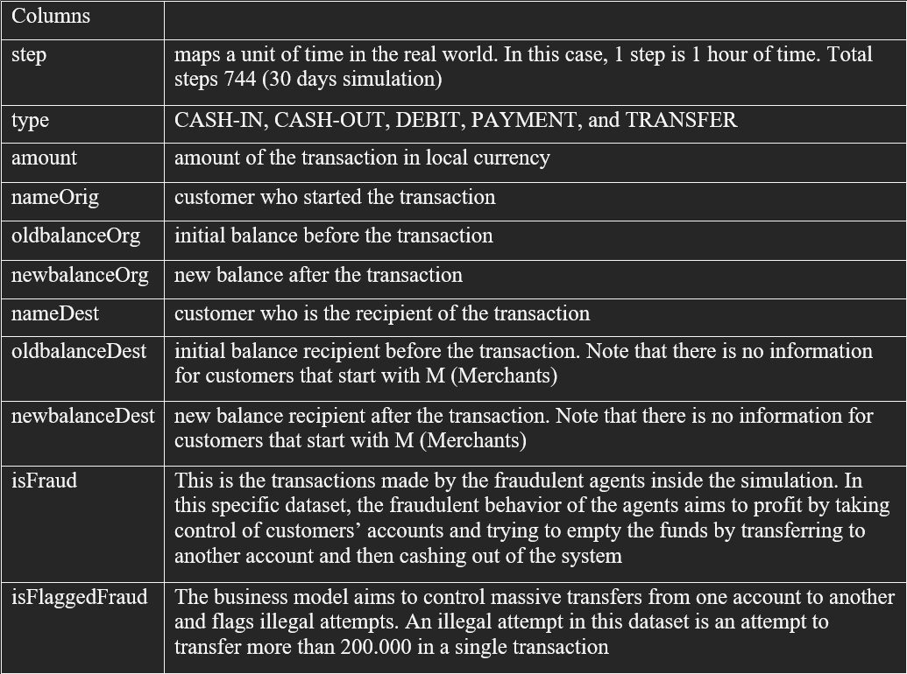
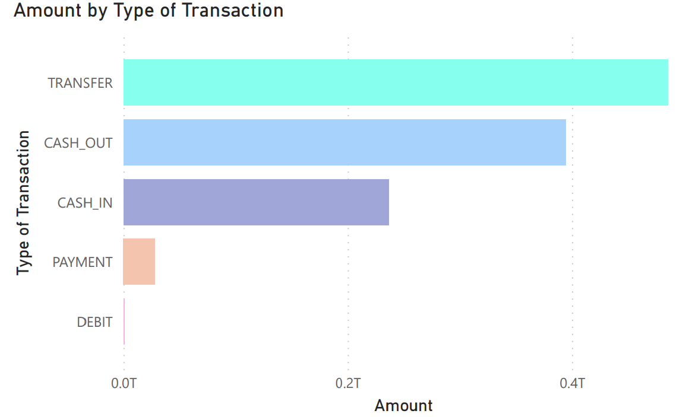
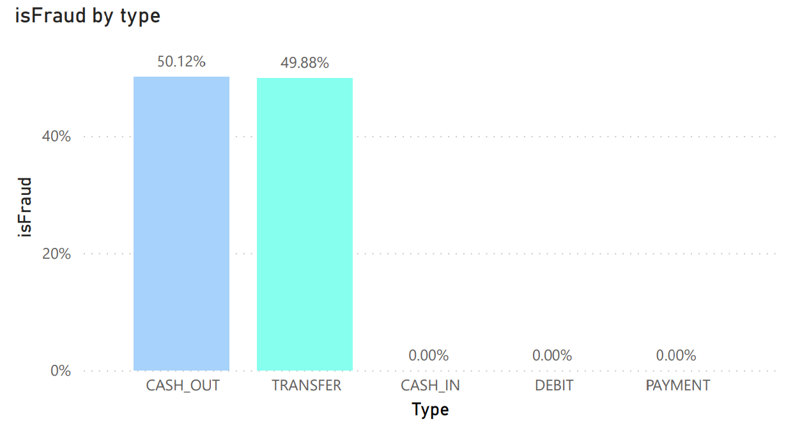
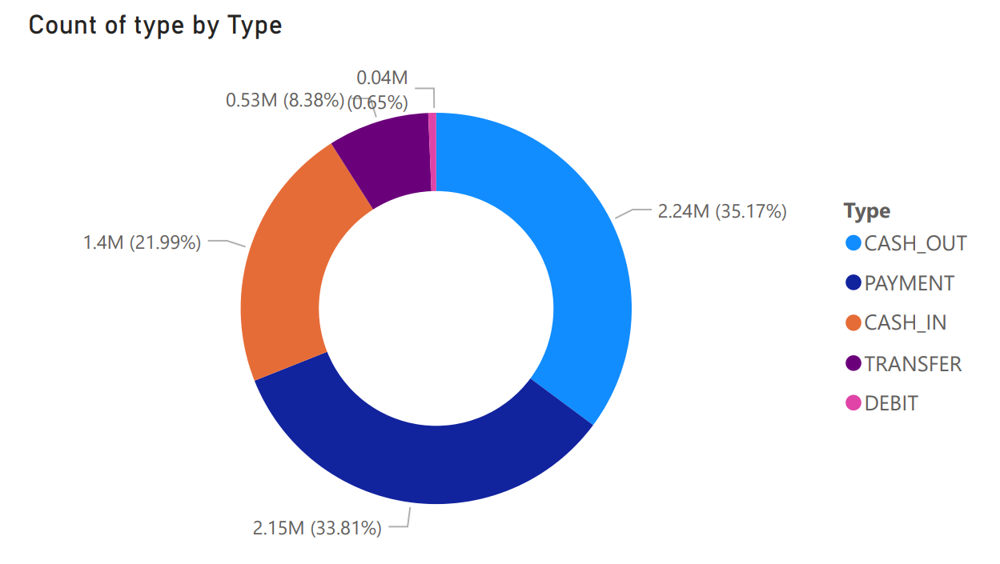
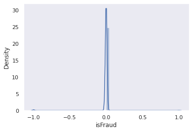
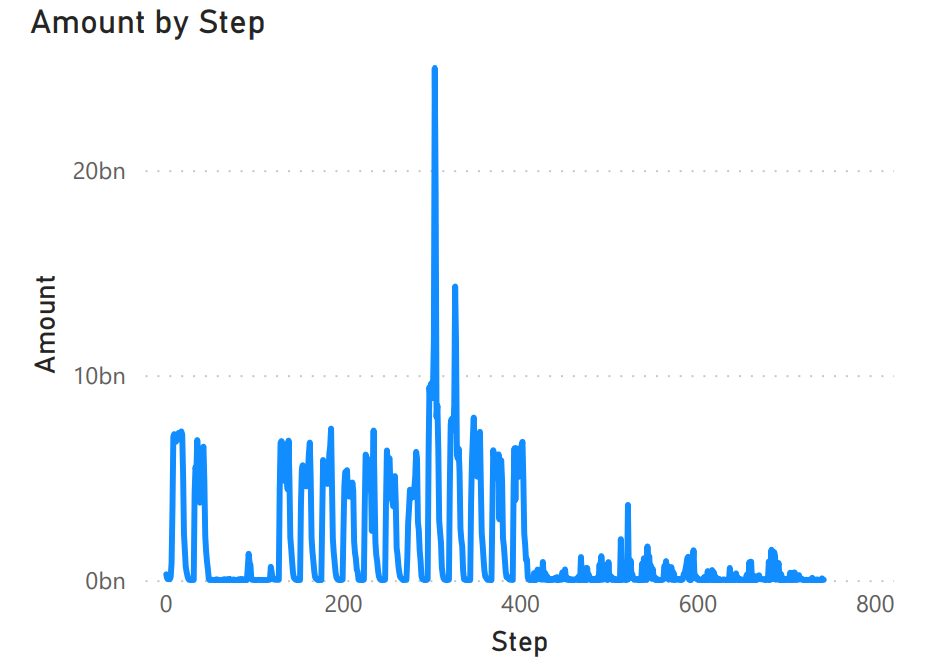
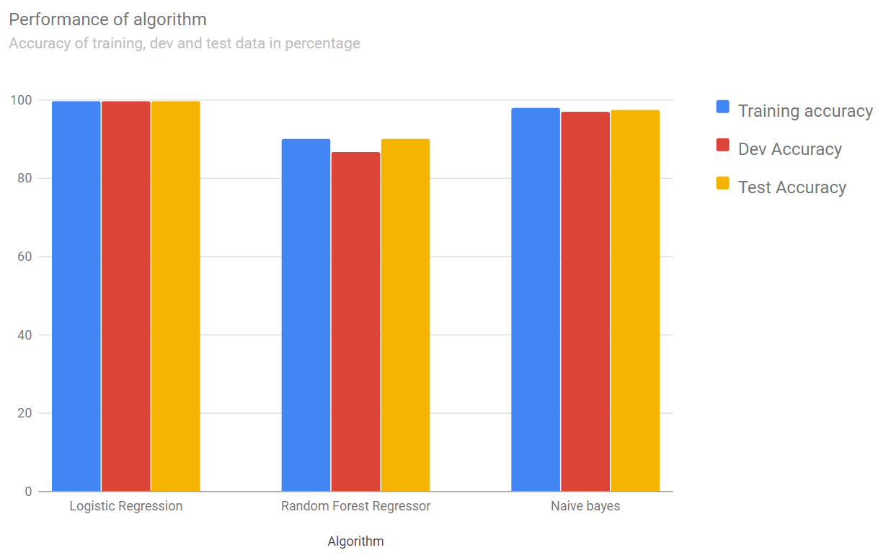

# Financial Fraud Detection

## Introduction

### What is fraud detection?
Fraud detection is a set of methods used to prevent money or assets from being gained through deception.

### Fraud detection Techniques
- Machine Learning
- Data Mining
- Neural networks
- Pattern Recognition

### Fraud detection using machine learning
Machine learning algorithms detect patterns in financial transactions and determine whether they are valid.They have the ability to detect fraudulent transactions that human auditors might miss, and they can do so in real time.

In this work we have used publicly available simulated payment transaction data and implemented various supervised machine learning algorithms to the problem of fraud detection.  We aim to highlight how supervised machine learning techniques may be utilised to accurately classify data with substantial class imbalance.

## Data Description
- The dataset has over 6 million transactions and 11 variables
- There is a variable named ‘isFraud’ that indicates actual fraud status of the transaction
- This is the class variable for our analysis

The columns in the dataset are described as follows: 

  

## Methodology

 

### Data analysis:

**1. Data Cleaning**

- Type conversion
- Dropping columns
- Removing unwanted rows (PAYMENT, CASH-IN and DEBIT) and managed to reduce the data from over `6 million` transactions to `~2.8 million` transactions
- Creating dummy variables 

**2. Exploratory Data Analysis**

 
  
- Maximum transaction amount was via `Transfer` while `debit` being the least

 
  
- Fraudulant transactions oocured only by transactions via `Cash Out` and `Transfer`

 
  
- People use `Cash Out` method the most for transaction while `Debit` being the least

## Model Building
- The data is normalized using `Sklearn Standard Scalar`
- The data is splitted into three respective sets:
  - Train set(98%)
  - Dev set(1%)
  - Test set(1%)
- The train data was then fed into the model
  - We trained the dataset on three models
    - Random Forest Regressor
    - Naive Bayes
    - Logistic Regression

## Data Visualization

- Gaussian Graph

  
  
- Scatter Plot

  

## Observations
- The transaction is fraudulent if the transfer amount is substantially less or more than the new balance of the destination
- According to the dataset given, if the destination is merchant then the account balance will be hidden. Therefore, we've put this into the consideration that the models performance doesn't get affected, which is done by keeping destination account column

  

- By this we can say that the transaction amount is maximum when step is between 300 and 350 and decreases drastically as the step increases

## Conclusion

  
According to the bar graph shown, we can conclude that logistic regression seems to produce excellent results. The performance of the Logistic regression is consistent between the training and testing datasets, so there is no overfitting
