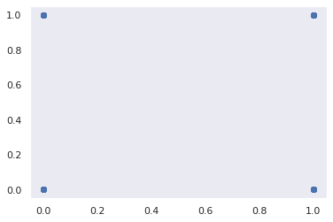

# Financial Fraud Detection

## Introduction

### What is fraud detection?
Fraud detection is a set of methods used to prevent money or assets from being gained through deception.

### Fraud detection Techniques
- Machine Learning
- Data Mining
- Neural networks
- Pattern Recognition

### Fraud detection using machine learning
Machine learning algorithms detect patterns in financial transactions and determine whether they are valid.They have the ability to detect fraudulent transactions that human auditors might miss, and they can do so in real time.

In this work we have used publicly available simulated payment transaction data and implemented various supervised machine learning algorithms to the problem of fraud detection.  We aim to highlight how supervised machine learning techniques may be utilised to accurately classify data with substantial class imbalance.

## Data Description

## Methodology
### Data analysis
### Data Cleaning
### Exploratory Data Analysis
  
  
  

### Model Building
### Data Visualization

- Gaussian Graph

  
  
- Scatter Plot

  

## Observations
- The transaction is fraudulent if the transfer amount is substantially less or more than the new balance of the destination
- According to the dataset given, if the destination is merchant then the account balance will be hidden. Therefore, we've put this into the consideration that the       models performance does'nt get affected, which is done by keeping destination account column

  

- By this we can say that the transaction amount is maximum when step is between 300 and 350 and decreases drastically as the step increases

## Conclusion
